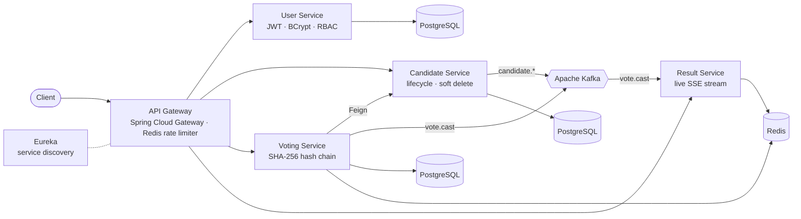

<div align="center">


<a href="https://git.io/typing-svg"></a>

<br/>

[](https://vaibhavjain-portfolio.vercel.app/)
[](https://www.linkedin.com/in/-vaibhavjain/)
[](https://vaibhavjain-portfolio.vercel.app/Vaibhav_Jain_Java_Backend_Developer_CV.pdf)
[](mailto:vaibhav.jain.careers@gmail.com)
[](https://github.com/Vaibhav0710)

</div>

---

## `$ whoami`

```java
@Service
public class VaibhavJain implements BackendDeveloper {

    private final String role       = "Junior Software Developer @ IntelligentDX"; // healthtech software for eye-care practices
    private final String location   = "Pune, India 🇮🇳";
    private final String experience = "1.5 years: intern from Apr 2025, full-time since Nov 2025";

    private final String[] workStack    = { "Python (Flask)", "Node.js (Express)", "C#/.NET", "PostgreSQL", "Redis", "BigQuery", "Google Cloud" };
    private final String[] projectStack = { "Java", "Spring Boot", "Spring Cloud", "Kafka" };

    @Override
    public String atWork() {
        return "Booking and scheduling APIs on Google Cloud, from treatment-plan booking to Cloud Run sync jobs";
    }

    @Override
    public String sideQuest() {
        return "A tamper-evident online voting platform: 6 Spring Boot services, every vote hash-chained";
    }

    @Override
    public String origin() {
        return "B.E. Mechanical (MESCOE Pune, 2019–2023) → PG-DAC (C-DAC) at Sunbeam Pune";
    }
}
```

---

## ⚙️ &nbsp;Work highlights

| | At **IntelligentDX** · healthtech software for eye-care practices |
|:-:|:--|
| 📅 | Built a **treatment-plan booking API** that books every visit of a multi-appointment plan across up to **15 parallel lanes**, with atomic slot reservation, one audit row per appointment and 200/207/422 responses. In production since **September 2026**. |
| 🔁 | Built **cancel and reschedule APIs** on an EHR with no native reschedule: book the new slot first, retry at timed offsets, return **HTTP 207** on partial success, full audit trail. |
| ⏱️ | Designed **background sync** (Cloud Scheduler → Cloud Run Jobs → PostgreSQL) for **213 providers × 111 locations × 70 visit types**, replacing slow or timing-out external calls with indexed database reads. |
| ⚡ | Cut the **slot-search API** from about **2.7–3.6 s to 1.7–2.5 s** with a concurrent pager, and moved scheduling APIs to an EHR's **FHIR R4** API with unchanged API contracts. |
| 🤖 | Designed an **AI rule-generation platform** around Claude with validation gates and a repair loop; prompt caching cut cost per generated rule by about **27–31%**. |
| 🧳 | *Internship:* migrated **10 API read paths** across **5 C#/.NET microservices** from MongoDB to PostgreSQL in about **8 weeks**; 9 reached production with identical responses. |

---

## 🗳️ &nbsp;Flagship project: Blockchain-Inspired Voting System

> An online election platform built so that **tampering with stored votes is detectable**. Each vote stores the SHA-256 hash of the vote before it, so editing or deleting any row breaks the chain, and a verification endpoint can find the break.



<table>
<tr>
<td width="50%" valign="top">

**🔗 How the chain works**

```java
String prevHash = lastVoteOpt
        .map(Vote::getVoteHash)
        .orElse("GENESIS");

String newHash = hashingService.generateHash(
        userId + candidateId + electionId
        + timestampSeconds + prevHash);
```

`POST /api/v1/votes/chain/validate/{electionId}` (admin only) recomputes every hash in the election and reports how many links are broken.

</td>
<td width="50%" valign="top">

**🛡️ What stops a double vote**

- A Redis `voted:` key gives a fast rejection
- A unique constraint in the database is the final guard
- Idempotency keys make retries safe
- The gateway rate-limits each user with Redis token buckets
- Results update live over **Server-Sent Events**

</td>
</tr>
</table>

| Service | Responsibility | Repo |
|:--|:--|:--:|
| 🧭 API Gateway | Routing, JWT check through User Service, Redis rate limiting | [`Voting_Api-Gateway`](https://github.com/Vaibhav0710/Voting_Api-Gateway) |
| 👤 User Service | Registration, login, BCrypt, Voter/Admin roles | [`Voting_User_Service`](https://github.com/Vaibhav0710/Voting_User_Service) |
| 🧑‍💼 Candidate Service | Candidate lifecycle (Active / Disqualified / Withdrawn), Kafka events | [`Voting_Candidate_Service`](https://github.com/Vaibhav0710/Voting_Candidate_Service) |
| 🗳️ Voting Service | Casting votes, hash chaining, verification, double-vote guard | [`Voting_Voting_Service`](https://github.com/Vaibhav0710/Voting_Voting_Service) |
| 📊 Result Service | Live counts from Kafka, kept in Redis, streamed over SSE | [`Voting_Result_Service`](https://github.com/Vaibhav0710/Voting_Result_Service) |
| 📡 Eureka Server | Service discovery | [`Voting_Eureka_Server`](https://github.com/Vaibhav0710/Voting_Eureka_Server) |

<div align="center">

**Java 17 · Spring Boot 3.3 · Spring Cloud 2023 · Kafka · Redis · PostgreSQL · OpenFeign · JJWT** &nbsp;→&nbsp; [**Voting_System**](https://github.com/Vaibhav0710/Voting_System)

</div>

---

## 🧰 &nbsp;More things I've built

<table>
<tr>
<td width="50%" valign="top">

### 🌐 [Portfolio](https://github.com/Vaibhav0710/Portfolio)
My personal portfolio site, deployed on Vercel.
<br/><sub>`Next.js` `TypeScript` `Tailwind` `Vercel`</sub>
<br/>[**→ Live site**](https://vaibhavjain-portfolio.vercel.app/)

</td>
<td width="50%" valign="top">

### 📦 [Courier Management System](https://github.com/Vaibhav0710/Courier-management-system)
A full-stack delivery platform with separate Admin, Customer and Delivery-Partner modules, JWT login, OpenAPI docs and a contact form.
<br/><sub>`Java 21` `Spring Boot 3.4` `Spring Data JPA` `Spring Security + JWT` `springdoc OpenAPI` `MySQL` `React`</sub>

</td>
</tr>
<tr>
<td width="50%" valign="top">

### 🚗 [Rent-A-Car](https://github.com/Vaibhav0710/Rent_A_Car)
A console car-rental system with entity, DAO and service layers. Admins manage the fleet and bookings; customers register and book.
<br/><sub>`Java 17` `JDBC` `MySQL` `Maven`</sub>

</td>
<td width="50%" valign="top">

### 👥 [User Management REST API](https://github.com/Vaibhav0710/Backend-Developer-Intern-Assignment-Submission-Details)
A backend internship assignment: a CRUD REST API with routes, controller, model and DB config in separate modules, required-field checks and 400/404/500 error responses.
<br/><sub>`Node.js` `Express` `MySQL`</sub>

</td>
</tr>
<tr>
<td width="50%" valign="top">

### 🍕 [Pizza Shop](https://github.com/Vaibhav0710/Pizza-Shop)
A console ordering system with login, a categorised menu, a cart and an admin view of orders.
<br/><sub>`Core Java` `JDBC` `MySQL`</sub>

</td>
<td width="50%" valign="top">

### 🌱 [Autonomous Farming Robot](https://github.com/Vaibhav0710/DesignDevelopmentOfAutonomousFarmingWithPlanthealthIndicationSystem)
Final-year B.E. project: an IoT robot that monitors crop and soil health and detects leaf disease with image processing.
<br/><sub>`ESP32` `Arduino` `OpenCV` `Python` `IoT sensors`</sub>

</td>
</tr>
</table>

<details>
<summary><b>🎮 &nbsp;Games and early builds</b> (click to expand)</summary>
<br/>

| Project | What it is | Stack |
|:--|:--|:--|
| 🧩 [Sudoku](https://github.com/Vaibhav0710/Sudoku_Game) | A desktop Sudoku with a puzzle generator, saved progress, and separate domain, persistence and UI layers | `Java` `JavaFX` |
| 🎬 [Movie Finder](https://github.com/Vaibhav0710/Movie-Finder) | Search movies and view details from the OMDB API | `React` `JavaScript` |

</details>

---

## 🧠 &nbsp;Problem-solving

<div align="center">

[](https://github.com/Vaibhav0710/Leetcode-solution)
[](https://github.com/Vaibhav0710/Daily_DSA)
[](https://github.com/Vaibhav0710/CS50X)
[](https://github.com/Vaibhav0710/CS50P)

<sub>LeetCode and TUF+ solutions sync automatically through LeetHub and TUFHub.</sub>

**📜 Certifications**<br/>
<sub>Java Full Stack LIVE Course (Spark 2.0) · Alpha: DSA with Java (Apna College) · Google Cloud Bootcamp (GeeksforGeeks) · LeetCode 100 Days Badge 2024</sub>

</div>

---

## 🛠️ &nbsp;Tech arsenal

<div align="center">


<br/><br/>

<br/><br/>


<br/><br/>


<sub>At work: Python (Flask), Node.js (Express), C#/.NET, PostgreSQL, Redis, BigQuery, Google Cloud.<br/>In projects and training: Java, Spring Boot, Spring Cloud, Kafka.</sub>

</div>

---

## 🔭 &nbsp;Next on the roadmap

```diff
+ Resilience4j circuit breakers between the voting services
+ Prometheus + Grafana dashboards for every service
+ Docker images and Kubernetes manifests for the voting platform
+ Deeper system design: consistency, partitioning, back-pressure
```

---

## 📊 &nbsp;GitHub analytics

<div align="center">


<picture>
  <source media="(prefers-color-scheme: dark)" srcset="https://raw.githubusercontent.com/Vaibhav0710/Vaibhav0710/output/github-snake-dark.svg" />
  <source media="(prefers-color-scheme: light)" srcset="https://raw.githubusercontent.com/Vaibhav0710/Vaibhav0710/output/github-snake.svg" />
  
</picture>

</div>

---

<div align="center">

### 💡 *"Make it work, make it right, make it fast" (in that order)*

**Open to conversations about backend engineering, distributed systems and interesting problems.**<br/>
[Say hi →](mailto:vaibhav.jain.careers@gmail.com)


</div>
